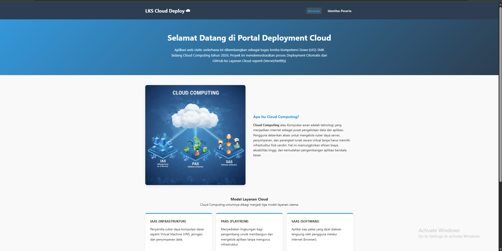
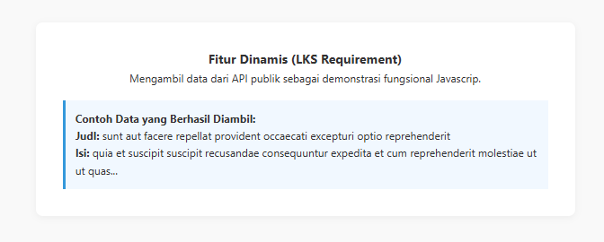
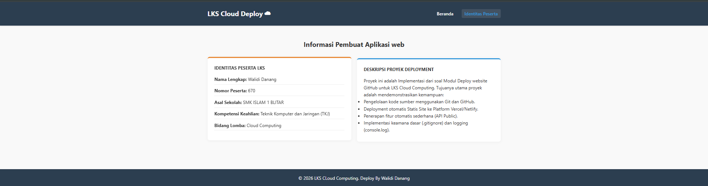

# Web Deployment - LKS Cloud computing 2026

## 📝 Deskripsi Proyek
APlikasi ini adalah sebuah Web aplikasi statis yang diabngun untuk memenuhi kualifikasi LKS SMK Ma'arif NU jatim 2026. Proyek ini mendemonstrasikan integrasi CI/CD (Continous Integration/Continuous Deployment) menggunakan GitHub sebagai version control dan Vercel sebagai Platform-as-a-service (Paas).

**Fitur Utama:**
* **Konten Edukasi**: Penjelasan mengenai Cloud Computing (Iaas, Paas, Saas).
* **Fitur Dinamis**: Mengambil data secara asinkron dari API PUblic (JSONPlaceholder).
* **Loggging System**: Pemantauan status aplikasi melalui browser console.
* **Responsive Design**: Tampililan yang optimal di berbagai ukurang perangkat.

## 🚀 Langkah Deployment
1. **Version Control**: Inisialisasi Git lokal dan push kode ke GitHub Repository.
2. **Paas Integration**: Menghubungkan akun Vercel dengan reposiory GitHub.
3. **Auto Deployment**: Vercel akan otomatis mendeteksi peruabhan pada branch `main` dan melakukan build ulang (CI/CD).
4. **Verification**: Memastikan website dapat diakses melalui domain HTTPS yang disediakan.

## 🛠️ Teknologi yang Digunakan
* **Frontend**: HTML5, CSS3, JavaScript (Vanilla).
* **API**: JSONPlaceholder (External REST API).
* **Platform**: GitHub (SCM) & Vercel (Cloud Hosting).

## 🛡️ Keamanan & Optimasi
* **HTTPS**: Enkripsi SSL otomatis dari Vercel untuk keamanan transmisi data.
* **Clean Code**: JavaScript ditempatkan secara internal/modular untuk menghindari error 404 pada jalur file.
* **Error Handling**: Implementasi `.catch()` pada fungsi fetch untuk menangani kegagalan API.

## 📸 Tampilan Apliksi
Berikut adalah tampilan antarmuka dari web APP LKS CLoud Computing 2026:

### Beranda (Desktop)
Beranda Desktop
*Menampilkan hero section, pengertian Cloud Computing, dan model layanan (IaaS, PaaS, SaaS).*

### Fitur API Dinamis
Fitur API
*Menampilkan hasil pengambilan data secara real-time dari API publik.*

### Identitas Peserta (Tentang Saya)
Tentang Saya
*Halaman identitas resmi peserta LKS.*

## 🔗 Tautan Penting
* **Repository**: [https://github.com/ptrdanang/lks-cloud-670.git]
* **link Web**: [https://lks-cloud-670.vercel.app/]

---
**Identitas Peserta:**
* **Nama**: Walidi Danang
* **Bidang**: Cloud Computing - LKS 2026